<div align="center">



</div>

```console
pouya@github:~$ whoami
pouya khodadust · builder · indie hacker · automation nerd

pouya@github:~$ cat mission.txt
turn manual busywork into bots. ship small, ship often, ship open source.
```

## `~/projects`

```console
pouya@github:~$ ls -l ~/projects
```

| repo | what it does | built with |
|:--|:--|:--|
| 🎮 **[joymind](https://github.com/P-Khodadust/joymind)** | AI chat client for Nintendo Switch homebrew: Claude, GPT, Gemini and local models, with screenshot questions, SSH commands and your game library | `C++` `libnx` `SDL2` |
| ⚖️ **[crucible](https://github.com/P-Khodadust/crucible)** | Autonomous plan → build → judge loop for Claude Code: a planner, a builder, and a jury of skeptical judges that proves every acceptance criterion before it ships | `JavaScript` |
| 🛩️ **[postpilot](https://github.com/P-Khodadust/postpilot)** | Telegram-native SaaS that schedules posts to X through the official API: multi-tenant, exactly-once scheduler, Dockerized | `Python` `FastAPI` `aiogram` |
| 🔤 **[Claude-RTL](https://github.com/P-Khodadust/Claude-RTL)** | Makes Persian and Arabic render right-to-left on claude.ai. A tiny Manifest V3 extension with zero dependencies and no permissions | `JavaScript` |

## `~/stack`

```console
pouya@github:~$ tree ~/stack
~/stack
├── lang/      python · c++ · javascript · bash
├── backend/   fastapi · aiogram · postgresql · redis
├── infra/     docker · linux · github actions
└── ai/        llm agents · claude · automation
```

<p align="left">
  
</p>

## `~/activity`

```console
pouya@github:~$ ./snake --eat contributions
```

<picture>
  <source media="(prefers-color-scheme: dark)" srcset="https://raw.githubusercontent.com/P-Khodadust/P-Khodadust/output/snake-dark.svg">
  
</picture>

## `~/contact`

```console
pouya@github:~$ ping pouya
64 bytes from github.com/P-Khodadust: issues and pull requests open, collabs on automation and indie tools welcome
```

<a href="https://github.com/P-Khodadust"></a>


<sub>`exit 0`</sub>
